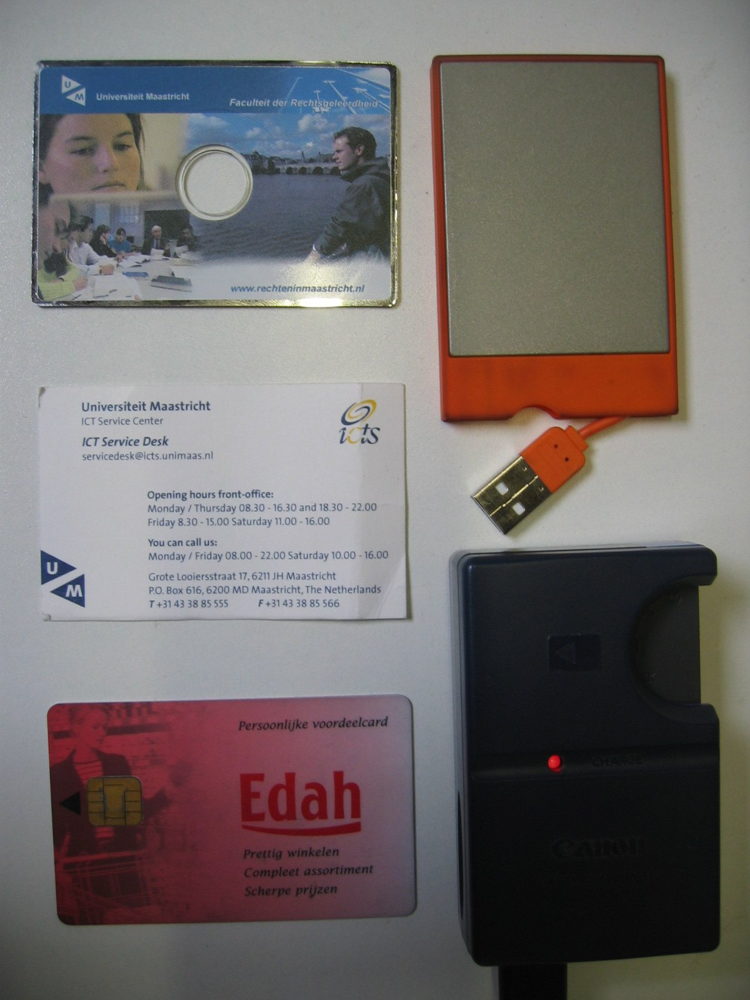
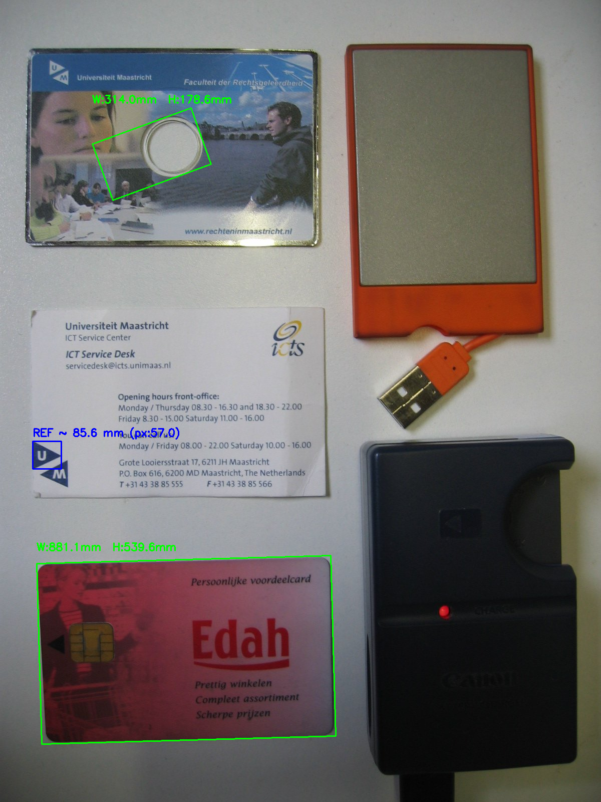

# OpenCV Measuring Tool
Measure object size in millimeters using a known-width reference object. 
(참조 물체의 실제 폭을 알고 있을 때, 이미지 속 다른 물체의 가로·세로 길이를 mm 단위로 계산합니다.)

This project demonstrates how computer vision can estimate real-world object dimensions
from a single image using a reference object, which is useful for inspection, education,
and simple measurement applications.
(이 프로젝트는 기준 물체(reference object)를 활용하여 단일 이미지로부터 실제 세계의 물체 크기를 추정하는 컴퓨터 비전 기법을 보여주며, 검사(inspection), 교육, 간단한 측정 도구 등의 용도로 활용될 수 있다.)

## Demo
Demo images will be saved under `docs/images/` after running the command below.

### Input


### Output



## Features
- Auto-detect reference contour and compute pixel-per-mm scale
- Measure all other objects in the same image
- Overlay width/height in mm on the result image
- Simple CLI

## Installation
Tested on: Python 3.10
```
pip install -r requirements.txt
```

## How to Run
Example (credit-card width 85.6 mm, reference placed at the LEFT side):
```
python src/app.py --image ./data/sample/synthetic.jpg --known_width_mm 85.6 --ref_hint left --out ./docs/images/out.jpg
```

## Options
- `--image`: path to input image
- `--known_width_mm`: known width of the reference object in mm (e.g., 85.6 for a card)
- `--ref_hint`: optional positional hint for reference selection: left | right | top | bottom
- `--canny`: two integers for Canny thresholds, e.g., `--canny 50 150` (default 50 150)
- `--min_area`: minimum contour area to consider (default 500)
- `--debug`: save intermediate images (edges, contours) to `docs/images/debug_*.jpg`

## Team Members

- Chanho Lee: core measurement logic, repository setup, integration
- Chanbin Park: README documentation, demo images
- Hwirang Yeo(leader) : testing, parameter tuning, contour filtering


## Project Structure
```
/src
  app.py
  measure.py
  utils.py
/data/sample      # put your images here
/docs/images      # outputs and screenshots
/tests
requirements.txt
README.md
LICENSE (optional)
```

## References
- OpenCV documentation: Contours, Canny edge, minAreaRect
- https://github.com/Practical-CV/Measuring-Size-of-Objects-with-OpenCV
- OpenCV Documentation: https://docs.opencv.org/
